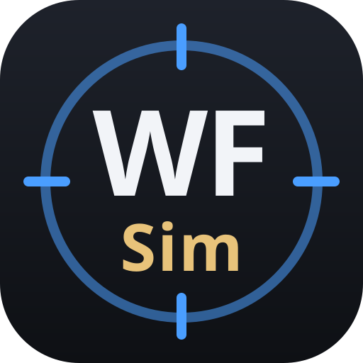

<div align="center">



# WFSim

**The real Simulacrum Prime.**

WFSim is the ultimate Warframe calculator — builder, simulator, optimizer.
True to in-game numbers, down to the last proc. Theorycrafting, solved.

[**wfsim.app**](https://wfsim.app) ·
QQ group [995078378](https://qm.qq.com/q/uiXrMSTs8S) ·
[Discord](https://discord.gg/5GXgbtmxY) ·
开发日志 [#01](https://www.bilibili.com/video/BV1An326vEtR/)

[](https://github.com/magenie33/wfsim/actions/workflows/ci.yml)

</div>

**Status:** in development. One weapon fully modeled (Dual Toxocyst, incl.
Incarnon). Single enemy per sim; no Rivens yet.

## Run

```sh
mise install             # pinned Rust toolchain
cargo test --workspace
cargo run -p wfsim-web   # web UI → http://localhost:8787
```

## Docs

[Design](docs/CORE.md) · [Mechanics](docs/MECHANICS.md) ·
[Measurements](docs/MEASUREMENTS.md) · [Custom weapons & mods](docs/CUSTOM.md) · [Data](data/README.md) ·
[Contributing](CONTRIBUTING.md)

## License

[AGPL-3.0-or-later](LICENSE). If you use this code in a product or
network service, you must release your modifications under the same
license. The "WFSim" name and logo are not covered by the license and
may not be used to brand derived products or services.

Game data derived from the community
[Warframe Wiki](https://wiki.warframe.com/) (CC BY-SA). Vendored
[WFCD/warframe-items](vendor/warframe-items/LICENSE) data remains MIT.
Unofficial fan project, not affiliated with Digital Extremes; Warframe
is a trademark of Digital Extremes Ltd.
