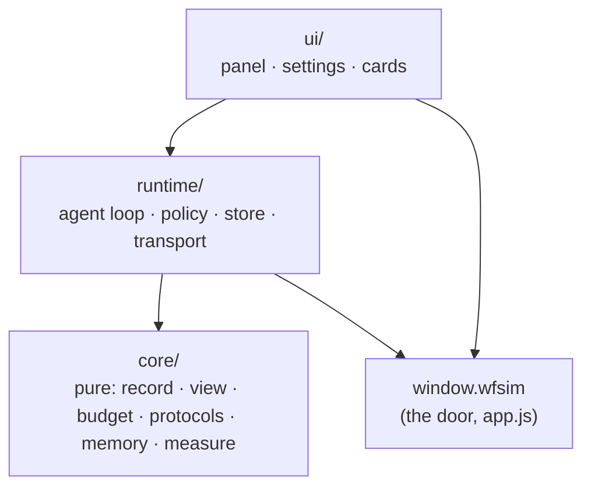

# Nona (九九), the in-page agent

Nona is a model the reader brings their own key for, driving the page through
the agent door (`docs/AGENT.md`). The door is the page's side of the contract;
this document is hers. It states what must stay true, where each piece lives,
what is stored and in what shape, and how a new capability is added without
eroding any of it.

## The invariants

Each one is enforced by something that fails. A rule with no enforcement is a
wish, and this module has already shown what wishes turn into.

| # | Invariant | Enforced by |
| --- | --- | --- |
| 1 | **She touches the page only through `window.wfsim`.** A capability she needs that the door lacks is added to the door first, where the reader's own control calls it too. | `check_nona_boundary` — no file under `nona/` names an identifier of `app.js` |
| 2 | **Every number she states comes from a tool result.** The prompt asks; the panel marks any number no tool returned. | `test_nona_core` (the checker), `nona_eval` (the count, target 0) |
| 3 | **The reader's documents are never edited in place.** The agent loop branches a build, fight, search, riven or target before her first write to it — policy in code, not in the prompt. Taking her copy back is a reader's click. | `check_nona` (reader's build asserted untouched) |
| 4 | **The key goes only to the address the reader chose**, and is kept past the tab only if they ask. | `check_nona` (storage assertions); one `fetch` in the module (`runtime/transport.js`) |
| 5 | **The record is whole and append-only.** Everything sent to a model is a pure function of the record, the settings, the memory and the tool table. Compaction writes marks into the record; it never rewrites or drops a message. | `test_nona_core` (view is deterministic; record unchanged by building it) |
| 6 | **The prefix is stable.** Rules, memory and tools are byte-identical from one request to the next within a conversation, so a provider's prompt cache keeps matching. | `test_nona_core` (two consecutive views share their prefix byte for byte) |
| 7 | **Every stored shape is versioned, and a name that ships is frozen.** Conversations, memory and settings live in readers' browsers; they are a wire. | `test_nona_core` (each old fixture migrates; no shipped name leaves `FROZEN`) |
| 8 | **Her tools are the door's table at request time**, plus her own few, appended after it in a fixed order. Nothing in her code lists what the page can do. | `check_nona` (tools sent = door + own). *Becomes, with §"Skills": every door action is reachable through a skill generated from the table; `check_nona` asserts the catalogue covers `tools()`.* |
| 9 | **Every zone of a request is under its cap, and the whole under W** — however long the conversation. *Designed (§"The context budget").* | `test_nona_core` over generated records of any length; S, T and one skill's size by build-time checks |

## The layers

Four layers, each depending only on those below it. The arrows are imports;
nothing imports upward.



| Layer | Owns | May use | May not |
| --- | --- | --- | --- |
| `core/` | the record and message shapes, migrations, the request view, the budget and compaction decisions, the summary's input, the number checker, both protocols' encoders and stream decoders, memory operations, the rules text | nothing but itself | `window`, `document`, `fetch`, storage, time, randomness — each is passed in. Imports without side effects, so Node can load it |
| `runtime/` | the agent loop, the branch policy, the loop guard, persistence, the one `fetch` | `core/`, `window.wfsim`, browser storage | the DOM; any `app.js` identifier |
| `ui/` | the panel, settings, the change card, the memory chips | `runtime/` (by its events), `core/` (pure helpers), `window.wfsim`, the DOM | calling a model; writing storage directly |
| the door | everything the page can do or answer | — | knowing Nona exists |

A pure function that needs "now" or an id takes them as arguments. That is
what makes the whole of `core/` testable in Node in milliseconds, and it is the
line between the two lower layers: if a function needs the browser, it is
`runtime/`.

## Files

```
web/src/static/nona/
  index.js                 mount: waits for the page's boot, builds the runtime, mounts the ui
  core/
    record.js              Conversation, Message, Settings, Memory shapes; migrate(); FROZEN
    view.js                view(record, settings, memory, tools) -> { system, messages }
    budget.js              estimate(); decide(record, window) -> marks to add
    summary.js             wantsSummary(); summaryInput(); SUMMARY_RULES
    measure.js             numbersIn(results); unmeasured(text, numbers)
    memory.js              set / forget / undo / block over a Memory value
    prompt.js              RULES(settings) — the byte-stable system text
    tools.js               her own tools (observe, history, memory), in fixed order
    protocols/
      sse.js               chunks -> events
      openai.js            encode(view, settings) -> body; decode(events | json) -> reply
      anthropic.js         the same, with cache breakpoints
  runtime/
    transport.js           the only fetch: request, stream, abort
    store.js               conversations (IndexedDB), memory and settings (localStorage), key (sessionStorage)
    policy.js              branch-before-write, from the door's observation and actions
    agent.js               ask(): the loop; emits events
  ui/
    kit.js                 the page's tr, dropdown and escaping (`wfsim.ui`), the reply markup
    panel.js  settings.js  cards.js  chips.js
```

**Loading.** Native ES modules, no bundler and no dependencies, as everywhere
else in the page. `index.html` loads `nona/index.js` with `type="module"`
after `app.js`, and it mounts on the page's `wfsim:ready`. The site build publishes the whole directory as
`site/asset/nona.<digest>/`, the digest taken over every file in it, so relative
imports keep working and a new release is a new directory; the dev server
serves the embedded files at `/nona/…`. A file added under `nona/` and missing
from either list fails `check_nona_boundary`.

## What is stored

Every shape carries `v`. `migrate()` in `core/record.js` takes any version this
code has ever written to the current one; a version newer than the code is left
untouched and read-only rather than guessed at.

| Key | Where | Shape (v1) |
| --- | --- | --- |
| `wfsim-nona` | localStorage | `{ v, base, proto, model, context, price, remember, concise, key? }` — `key` only when `remember` |
| `wfsim-nona-key` | sessionStorage | the key, when not remembered |
| `wfsim-nona-memory` | localStorage | `{ v, paused, items: MemoryItem[] }` |
| `wfsim-nona-calib` | localStorage | `{ [model]: ratio }` — token estimate calibration |
| `wfsim-nona` / `conversations` | IndexedDB | `Conversation` |

```
Conversation { v, id, title, pinned, created_at, updated_at, weapon,
               made: string[], pairs: {copy, from}[], summary: {upto, text} | null,
               usage: {input, output, cached, cost}, messages: Message[] }
Message = { role: "user", text, page, at, pageMasked? }
        | { role: "assistant", text, calls: {id, name, args}[], usage? }
        | { role: "tool", id, name, ok, line, result, masked? }
        | { role: "note", text }                      // shown, never sent
        | { role: "card", pair: {copy, from, state} } // shown, never sent
        | { role: "memory", id }                      // shown, never sent
MemoryItem { id, kind: "profile" | "note", key?, value, status: "active" | "proposed",
             source: {conversation, quote, by: "user" | "inferred"},
             created_at, updated_at, history: {value, until}[] }
```

An incognito conversation is never written. `FROZEN` lists every field name
above; renaming one is a new version with a migration, never an edit.

## One turn

```mermaid
sequenceDiagram
  participant UI as ui
  participant A as runtime/agent
  participant C as core
  participant T as runtime/transport
  participant D as window.wfsim
  UI->>A: ask(text)
  A->>D: observe()
  A->>A: append user message + page snapshot
  loop until no tool calls, at most 24 steps
    A->>C: decide(record) — marks to set aside; wantsSummary?
    A->>C: view(record, settings, memory, tools)
    A->>T: send(encode(view)) — streamed
    T-->>A: events → decode → reply
    A->>A: append assistant message
    A->>A: policy: branch before a write
    A->>D: do(id, args)
    A->>A: append tool result
  end
  A-->>UI: events: text, call, result, card, memory, usage, done
```

**One writer.** The agent owns the conversation being run and is the only thing
that appends to it; it persists after every append, so a closed tab loses at
most the reply in flight. The ui never writes the record — it renders events
while a turn runs and the record when a conversation is opened, through the
same functions, so the two cannot drift.

## Skills, and her fixed tools

**Status: designed, not built.** Today every door action is its own tool.

The door's table is too large to send whole on every request, and most of it is
not needed for any one question. So it reaches her the way a skill does: a
catalogue she always sees, and the full text of a part only once she asks
for it.

- **A skill is a door module** — `builder`, `simulator`, `optimizer`,
  `rivens`, `enemies`, `shell` — taken from the first segment of each action's
  id. Nothing in her code lists them, so an action added to the door is in its
  skill with no edit here.
- **The catalogue** is one line per skill: what it is for, and its actions'
  names. It sits in zone T.
- **`skill_load(skills)`** returns the named skills' documents: each action as
  a compact signature and one line of what it does, generated from the door's
  `actions` and `tools()` at the moment of the call. An argument that is one of
  a long list names the query that finds it instead of listing it.
- **`act(id, args)`** calls any door action. It runs through the same path a
  named tool did — branch before a write, the loop guard, the trail line with
  the real action id — and the door refuses a `hand` action to it as to
  anything else. There is no second way in.
- **`calc(expression)`** does arithmetic on measured numbers: `+ − × ÷`,
  brackets and percentages, parsed, never `eval`'d. Every number in the
  expression must be one she was sent in this request (§"What measured means",
  below); small whole numbers pass, as they do for the marker. A difference
  between two measured scores is then itself measured, and a figure she made up
  cannot be laundered through it.

Her fixed tools are then seven, in this order, and they do not change within a
release: `observe`, `history_search`, `memory_set`, `memory_forget`,
`skill_load`, `act`, `calc`.

Two costs are taken on knowingly. A question about a part she has not loaded
takes one more request — which is why the skill of the module the reader is on
is preloaded with their message. And a generic `act` gives the provider no
schema to guide the arguments; the door's refusals name the argument and its
alternatives, and `nona_eval` measures whether a model copes. One that does not
is a reason to keep a few actions as named tools again, not to guess.

## The context budget

**Status: designed, not built.** The code sets old tool results aside past
half the window and summarises past 70% of it (`core/budget.js`,
`core/summary.js`); this section replaces that with zones. The numbers below
are starting values, tuned against `nona_eval`; the structure is the rule.

A conversation may go on for ever. What makes that possible is two stores of
different kinds: **the record**, whole and append-only, in the reader's
browser, and **the request**, which has a hard size and is rebuilt from the
record for every call. The record grows without bound; the request never does.
Anything that has left the request is still in the record, and
`shell_history_search` reaches it.

### Two ceilings

- **X**, the model's context window, from the address's model list or the
  reader. A request larger than X fails, so this is a hard limit.
- **B**, the cost budget: what one request may spend on input. A model with a
  million-token window is still sent a small request.

The input one request may hold is **W = min(X − O − margin, B)**, where O is
the output reserved for the reply. A model whose W cannot hold the fixed zones
below is refused, with that reason, rather than run badly.

### The zones

The request is built in this order, most stable first. Every zone has a cap;
each is kept under it by the mechanism named, and nothing else writes it.

| Zone | Holds | Cap | Kept under it by |
| --- | --- | --- | --- |
| **S** rules | who she is, what she may do | 1.5k | a build-time check: over it, CI fails and the rules are rewritten |
| **T** tools | her fixed tools and the skill catalogue | 2k | a build-time check: a door that outgrows it fails CI until descriptions are shortened |
| **M** memory | the reader's profile, as frozen for this stretch | 0.8k | memory compaction |
| **K** skills | the skill documents she has loaded | 4k, one skill ≤ 2k | unloading the least recently used; a skill over 2k fails a build-time check |
| **H** history | the summary, then the turns since it | 6k, summary ≤ 1.5k | setting results aside, then summarising |
| **P** this turn | the reader's message, its page, this turn's calls and results | 6k; page ≤ 0.5k, one result ≤ 2k | setting this turn's older results aside |
| **O** output | her reply | 2k–4k | the request's `max_tokens` |

S and T are fixed for a release and M for a stretch of conversation, so they
form a prefix that a provider's cache keeps matching. Only K, H and P change,
and they come last.

### Keeping each zone under its cap

Before every request, one pure function in `core/` measures the zones and
returns what to do. A zone over its cap (the **high water mark**) is brought
down to 60% of it (the **low water mark**), not just under the line: every
compaction breaks the provider's cache once, and the room left over is what
makes the next one rare.

The cheapest step comes first:

1. **P over its cap.** This turn's older tool results are set aside, each
   replaced by one line saying what it was and that the call can be repeated.
   The newest two stay verbatim.
2. **H over its cap.** First, the results of earlier turns are set aside. Then
   the older page snapshots go. Then the oldest turns are summarised by the
   model into the summary, which keeps every measured number only with its
   source. A summary over its own cap is summarised again.
3. **K over its cap.** The least recently used skill is unloaded and replaced
   by one line saying it can be loaded again.
4. **M over its cap.** Profile slots are overwritten in place and cannot
   grow. Notes are cut oldest-unused first, and unconfirmed items are never
   sent. If that is not enough, the model merges notes into fewer, and the
   result is shown to the reader as a proposal they can undo: memory is
   theirs, and it is not rewritten behind their back.

**A SUMMARY IS THE MOMENT FOR EVERYTHING ELSE.** Summarising breaks the cache
anyway, so M's snapshot is refreshed then, and memories written since take
effect in the prefix. The loaded skills' documents are regenerated from the
door after the summary, from the list kept in the record, with no call from
her. Between summaries the prefix does not move.

The function's contract: after it runs, every zone is under its cap and the
whole is under W. `test_nona_core` holds it to that over generated records of
every length, including ones far longer than any real conversation.

### Round n + 1

After n rounds, with rounds 1 to k summarised, the reader asks again:

```
── system ────────────────────────────────── shared by every conversation
 S  rules                                             ≤ 1.5k
 T  skill catalogue: builder · simulator · …          ┐
── tools ───────────────────────────────────          │ ≤ 2k
 T  observe · history_search · memory_set ·           │
    memory_forget · skill_load · act · calc           ┘
── system, continued ─────────────────────── fixed until the next summary
 M  <memory of this reader>                           ≤ 0.8k
── messages ──────────────────────────────── appended only
 H  <summary of rounds 1…k>                           ≤ 1.5k  ┐
 K  skill documents: builder, simulator               ≤ 4k    │
 H  rounds k+1…n: the reader's words, her replies,            │ H ≤ 6k
    her calls; their results set aside, one line each        ┘
 P  round n+1: the reader's words + <page>…</page>    ≤ 0.5k  ┐
    the skill of the module they are on, preloaded            │ P ≤ 6k
    this round's calls and results, newest two verbatim      ┘
── max_tokens ─────────────────────────────── O  2k–4k
```

With the caps above, a request holds at most about 22k tokens of input and
typically 8k–12k, whatever X is. A larger X decides only whether a model can
run, never what it costs; B is what the reader may raise to have her keep
more in view.

### What measured means

A number counts as measured when it is in the request she was sent — a tool
result still in view, the page, or the summary with its source. A number that
has left the request is no longer something she can see, so it is not
something she can state without reading it again.

### The record, for ever

The record is never trimmed, because it is the reader's and because it is what
`shell_history_search` and a reopened conversation read. It is kept in
segments, so a long conversation is not rewritten whole on every save, and the
panel draws the latest ones and loads earlier ones on scroll. A result is
already capped at 2k tokens when it is recorded, which bounds what one round
can add.

## The page's side

Everything she reads or changes is on the door:

| She needs | On the door |
| --- | --- |
| which build, scenario, search, riven and target are open; whether the fight is an official ruler | `observe().open`, `observe().official_scenario` |
| whether an action writes, and what it writes | `actions[i].query` and a declared `writes` (build, scenario, search, riven, target, prefs, bar, none) |
| a build's contents, named, to compare her copy with the reader's | the query `shell.preset.read` |
| the reader taking her copy back | `shell.preset.adopt`, an action marked **`hand`**: offered to the page's own controls, never in `tools()` — a model cannot call it |
| the leaderboard, for suggestions | `builder.board.read` |
| the page's translation, dropdown and escaping, for her own ui | `wfsim.ui` |
| when the page has booted | `observe().ready` and the `wfsim:ready` event |

`hand` is the rule `docs/AGENT.md` already states for outward actions —
"a reader's gesture" — made checkable: an action a model must never call is
not in `tools()`, whatever it does.

## Tests

| Kind | What | Runs |
| --- | --- | --- |
| `test_nona_core` | Node, no browser: migrations from every fixture version; the view is deterministic and leaves the record unchanged; two consecutive views share their prefix; budget marks the oldest first and keeps the newest; the summary's input; the number checker; both protocols encode to their golden bodies and decode recorded streams; memory set / forget / undo / block | CI, seconds |
| `check_nona_boundary` | static: no `nona/` file names an `app.js` identifier; imports point down; each layer keeps to what it may touch; every file is in the site build and the dev server lists | CI, seconds |
| `check_nona` | the browser, against a stand-in provider: the loop end to end, the branch policy, storage, the ui | CI |
| `nona_eval` | a real model, by hand: behaviour graded per case | after prompt, tool or door changes |

A new test is trusted once it has failed on the broken input (`AGENTS.md`).

## Adding something

One capability at a time, each landing with its checks green: a short design
note first, then the code, then the case that fails without it.

| To add | Do this | Never |
| --- | --- | --- |
| a thing she can do or read on the page | a row in the door's table, called by the page's own control too | code in `nona/` that reaches the page |
| a provider protocol | `core/protocols/<name>.js` with `encode`/`decode`, golden fixtures, and detection in `runtime/transport.js` | a branch on the provider inside the loop |
| a stored field | bump `v`, write the migration, add the old fixture, extend `FROZEN` | rename or drop a shipped field |
| one of her own tools | `core/tools.js`, appended at the end (the prefix stays stable), its handler in `runtime/agent.js` | a tool that duplicates a door action |
| a rule of behaviour | enforce it in `runtime/policy.js` where code can; the prompt only where it cannot, with an `nona_eval` case | a prompt sentence standing in for a check |
| something on screen | `ui/`, driven by the agent's events | ui that writes the record or calls a model |

## What she does not do

- **Nothing leaves the browser** but the requests to the reader's own address.
  No server of ours sees a key, a conversation or a memory; that changes only
  with accounts, under the boundaries in the plan's research page.
- **No outward action**: sharing, submitting to the board, opening a link.
- **No hand action**: she proposes, the reader takes.
- **No framework, bundler or dependency** — the page has none.
