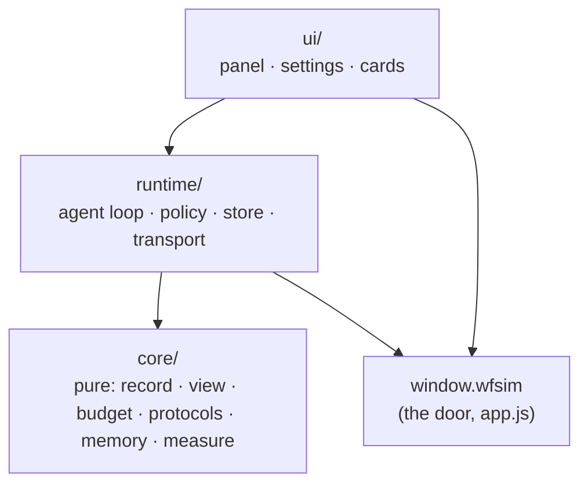

# Nona (九九), the in-page agent

**Status: this is the target structure; step 1 of §"Moving in" has landed.**
Until step 3 does, the code lives in `web/src/static/app.js` §NONA and still
reads page variables where the door now answers; step 3 removes each one.

Nona is a model the reader brings their own key for, driving the page through
the agent door (`docs/AGENT.md`). The door is the page's side of the contract;
this document is hers. It states what must stay true, where each piece lives,
what is stored and in what shape, and how a new capability is added without
eroding any of it.

## The invariants

Each one is enforced by something that fails. A rule with no enforcement is a
wish, and this module has already shown what wishes turn into.

| # | Invariant | Enforced by |
| --- | --- | --- |
| 1 | **She touches the page only through `window.wfsim`.** A capability she needs that the door lacks is added to the door first, where the reader's own control calls it too. | `check_nona_boundary` — no file under `nona/` names an identifier of `app.js` |
| 2 | **Every number she states comes from a tool result.** The prompt asks; the panel marks any number no tool returned. | `test_nona_core` (the checker), `nona_eval` (the count, target 0) |
| 3 | **The reader's documents are never edited in place.** The agent loop branches a build, fight, search, riven or target before her first write to it — policy in code, not in the prompt. Taking her copy back is a reader's click. | `check_nona` (reader's build asserted untouched) |
| 4 | **The key goes only to the address the reader chose**, and is kept past the tab only if they ask. | `check_nona` (storage assertions); one `fetch` in the module (`runtime/transport.js`) |
| 5 | **The record is whole and append-only.** Everything sent to a model is a pure function of the record, the settings, the memory and the tool table. Compaction writes marks into the record; it never rewrites or drops a message. | `test_nona_core` (view is deterministic; record unchanged by building it) |
| 6 | **The prefix is stable.** Rules, memory and tools are byte-identical from one request to the next within a conversation, so a provider's prompt cache keeps matching. | `test_nona_core` (two consecutive views share their prefix byte for byte) |
| 7 | **Every stored shape is versioned, and a name that ships is frozen.** Conversations, memory and settings live in readers' browsers; they are a wire. | `test_nona_core` (each old fixture migrates; `FROZEN` only shrinks) |
| 8 | **Her tools are the door's table at request time**, plus her own few, appended after it in a fixed order. Nothing in her code lists what the page can do. | `check_nona` (tools sent = door + own) |

## The layers

Four layers, each depending only on those below it. The arrows are imports;
nothing imports upward.



| Layer | Owns | May use | May not |
| --- | --- | --- | --- |
| `core/` | the record and message shapes, migrations, the request view, the budget and compaction decisions, the summary's input, the number checker, both protocols' encoders and stream decoders, memory operations, the rules text | nothing but itself | `window`, `document`, `fetch`, storage, time, randomness — each is passed in. Imports without side effects, so Node can load it |
| `runtime/` | the agent loop, the branch policy, the loop guard, persistence, the one `fetch` | `core/`, `window.wfsim`, browser storage | the DOM; any `app.js` identifier |
| `ui/` | the panel, settings, the change card, the memory chips | `runtime/` (by its events), `core/` (pure helpers), `window.wfsim`, the DOM | calling a model; writing storage directly |
| the door | everything the page can do or answer | — | knowing Nona exists |

A pure function that needs "now" or an id takes them as arguments. That is
what makes the whole of `core/` testable in Node in milliseconds, and it is the
line between the two lower layers: if a function needs the browser, it is
`runtime/`.

## Files

```
web/src/static/nona/
  index.js                 mount: waits for the page's boot, builds the runtime, mounts the ui
  core/
    record.js              Conversation, Message, Settings, Memory shapes; migrate(); FROZEN
    view.js                view(record, settings, memory, tools) -> { system, messages }
    budget.js              estimate(); decide(record, window) -> marks to add
    summary.js             wantsSummary(); summaryInput(); SUMMARY_RULES
    measure.js             numbersIn(results); unmeasured(text, numbers)
    memory.js              set / forget / undo / block over a Memory value
    prompt.js              RULES(settings) — the byte-stable system text
    tools.js               her own tools (observe, history, memory), in fixed order
    protocols/
      sse.js               chunks -> events
      openai.js            encode(view, settings) -> body; decode(events | json) -> reply
      anthropic.js         the same, with cache breakpoints
  runtime/
    transport.js           the only fetch: request, stream, abort
    store.js               conversations (IndexedDB), memory and settings (localStorage), key (sessionStorage)
    policy.js              branch-before-write, from the door's observation and actions
    agent.js               ask(): the loop; emits events
  ui/
    panel.js  settings.js  cards.js  chips.js
```

**Loading.** Native ES modules, no bundler and no dependencies, as everywhere
else in the page. `index.html` loads `nona/index.js` with `type="module"`
after `app.js`. The site build publishes the whole directory as
`site/asset/nona.<digest>/`, the digest taken over every file in it, so relative
imports keep working and a new release is a new directory; the dev server
serves the embedded files at `/nona/…`. A file added under `nona/` and missing
from either list fails `check_nona_boundary`.

## What is stored

Every shape carries `v`. `migrate()` in `core/record.js` takes any version this
code has ever written to the current one; a version newer than the code is left
untouched and read-only rather than guessed at.

| Key | Where | Shape (v1) |
| --- | --- | --- |
| `wfsim-nona` | localStorage | `{ v, base, proto, model, context, price, remember, concise, key? }` — `key` only when `remember` |
| `wfsim-nona-key` | sessionStorage | the key, when not remembered |
| `wfsim-nona-memory` | localStorage | `{ v, paused, items: MemoryItem[] }` |
| `wfsim-nona-calib` | localStorage | `{ [model]: ratio }` — token estimate calibration |
| `wfsim-nona` / `conversations` | IndexedDB | `Conversation` |

```
Conversation { v, id, title, pinned, created_at, updated_at, weapon,
               made: string[], pairs: {copy, from}[], summary: {upto, text} | null,
               usage: {input, output, cached, cost}, messages: Message[] }
Message = { role: "user", text, page, at, pageMasked? }
        | { role: "assistant", text, calls: {id, name, args}[], usage? }
        | { role: "tool", id, name, ok, line, result, masked? }
        | { role: "note", text }                      // shown, never sent
        | { role: "card", pair: {copy, from, state} } // shown, never sent
        | { role: "memory", id }                      // shown, never sent
MemoryItem { id, kind: "profile" | "note", key?, value, status: "active" | "proposed",
             source: {conversation, quote, by: "user" | "inferred"},
             created_at, updated_at, history: {value, until}[] }
```

An incognito conversation is never written. `FROZEN` lists every field name
above; renaming one is a new version with a migration, never an edit.

## One turn

```mermaid
sequenceDiagram
  participant UI as ui
  participant A as runtime/agent
  participant C as core
  participant T as runtime/transport
  participant D as window.wfsim
  UI->>A: ask(text)
  A->>D: observe()
  A->>A: append user message + page snapshot
  loop until no tool calls, at most 24 steps
    A->>C: decide(record) — marks to set aside; wantsSummary?
    A->>C: view(record, settings, memory, tools)
    A->>T: send(encode(view)) — streamed
    T-->>A: events → decode → reply
    A->>A: append assistant message
    A->>A: policy: branch before a write
    A->>D: do(id, args)
    A->>A: append tool result
  end
  A-->>UI: events: text, call, result, card, memory, usage, done
```

**One writer.** The agent owns the conversation being run and is the only thing
that appends to it; it persists after every append, so a closed tab loses at
most the reply in flight. The ui never writes the record — it renders events
while a turn runs and the record when a conversation is opened, through the
same functions, so the two cannot drift.

## The page's side

Everything she reads or changes is on the door. What the current code takes
from `app.js` directly moves there first:

| She needs | Today | On the door |
| --- | --- | --- |
| which build, scenario, search, riven and target are open; whether the fight is an official ruler | `activePreset`, `activeScenario`, `activeOptPreset`, `activeRivenId()`, `activeEnemyName()`, `officialScenarioActive()` | fields of `observe()` |
| whether an action writes, and what it writes | `AGENT_ACTIONS`, `agentWritesFight()` | `actions[i].query` and a declared `writes` (build, scenario, search, riven, target, none) |
| a build's contents, to compare her copy with the reader's | `loadPresetList`, `snapshotState` | a query `shell.preset.read` |
| the reader taking her copy back | `storePresetList`, `whileApplying`, `pickPreset` | an action marked **`hand`**: offered to the page's own controls, never in `tools()` — a model cannot call it |
| names of mods and arcanes, localized | `modById`, `arcaneById`, `tr` | the finders; the page's `tr` for her own ui strings, passed in at mount |
| the leaderboard, for suggestions | `BOARD` | `builder.board.read` |
| the page's dropdown | `ddButton` | a small ui kit the page exports at mount, declared in `index.js` |

`hand` is the rule `docs/AGENT.md` already states for outward actions —
"a reader's gesture" — made checkable: an action a model must never call is
not in `tools()`, whatever it does.

## Tests

| Kind | What | Runs |
| --- | --- | --- |
| `test_nona_core` | Node, no browser: migrations from every fixture version; the view is deterministic and leaves the record unchanged; two consecutive views share their prefix; budget marks the oldest first and keeps the newest; the summary's input; the number checker; both protocols encode to their golden bodies and decode recorded streams; memory set / forget / undo / block | CI, seconds |
| `check_nona_boundary` | static: no `nona/` file names an `app.js` identifier; every file is in the site build and the dev server lists | CI, seconds |
| `check_nona` | the browser, against a stand-in provider: the loop end to end, the branch policy, storage, the ui | CI |
| `nona_eval` | a real model, by hand: behaviour graded per case | after prompt, tool or door changes |

A new test is trusted once it has failed on the broken input (`AGENTS.md`).

## Adding something

| To add | Do this | Never |
| --- | --- | --- |
| a thing she can do or read on the page | a row in the door's table, called by the page's own control too | code in `nona/` that reaches the page |
| a provider protocol | `core/protocols/<name>.js` with `encode`/`decode`, golden fixtures, and detection in `runtime/transport.js` | a branch on the provider inside the loop |
| a stored field | bump `v`, write the migration, add the old fixture, extend `FROZEN` | rename or drop a shipped field |
| one of her own tools | `core/tools.js`, appended at the end (the prefix stays stable), its handler in `runtime/agent.js` | a tool that duplicates a door action |
| a rule of behaviour | enforce it in `runtime/policy.js` where code can; the prompt only where it cannot, with an `nona_eval` case | a prompt sentence standing in for a check |
| something on screen | `ui/`, driven by the agent's events | ui that writes the record or calls a model |

## What she does not do

- **Nothing leaves the browser** but the requests to the reader's own address.
  No server of ours sees a key, a conversation or a memory; that changes only
  with accounts, under the boundaries in the plan's research page.
- **No outward action**: sharing, submitting to the board, opening a link.
- **No hand action**: she proposes, the reader takes.
- **No framework, bundler or dependency** — the page has none.

## Moving in

Each step lands on its own with every check green, and changes no behaviour a
reader can see.

1. **The door grows what she needs** — the observation fields, `writes`,
   `shell.preset.read`, the `hand` actions — with `check_agent_door` cases.
   *Landed*, and with it a page fix it exposed: a switch of document inside
   the auto-save's debounce dropped the reader's last edit (`flushPresetSaves`).
2. **`core/` and `test_nona_core`** — the pure logic moved out of `app.js` and
   unit-tested; not yet wired.
3. **`runtime/`, `ui/`, `index.js`** — the module loads beside `app.js`, the
   §NONA section is deleted from it, the site build and the dev server serve
   the directory, and `check_nona` passes unchanged.
4. **`check_nona_boundary`** — invariant 1 made to fail, proven on a planted
   reference; the Status line above goes.

Only then does a feature land again, one at a time.
